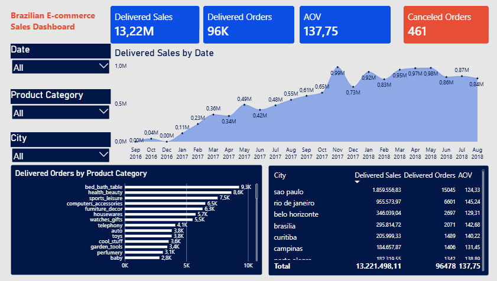

# Olist Power BI Analysis

## Project Overview

This Power BI project analyzes the Brazilian E-Commerce Public Dataset by Olist. The current version was created as part of a guided classroom exercise to practice data preparation, data modeling, DAX calculations, and dashboard design.

The report structure and calculations were developed by following the course material. I customized the dashboard layout, colors, and formatting.
## Dashboard Preview

## Dataset

The project uses the [Brazilian E-Commerce Public Dataset by Olist](https://www.kaggle.com/datasets/olistbr/brazilian-ecommerce), which contains information about orders, customers, products, payments, and delivery statuses.

## Tools Used

* Power BI Desktop
* Power Query
* DAX
* Data modeling

## Data Preparation

The following operations were practiced in Power Query:

* Importing CSV files
* Selecting and renaming columns
* Merging related tables
* Assigning appropriate data types
* Creating fact and dimension tables
* Disabling unnecessary table loads

## Data Model

A star schema was created using:

* `fact_sales`
* `dim_customer`
* `dim_product`
* `dim_date`

Relationships were established between the fact table and the corresponding dimension tables.

## DAX Measures

The report includes measures for:

* Delivered Sales
* Delivered Orders
* Average Order Value
* Canceled Orders

A separate date table was also created with DAX to support date-based analysis and chronological sorting.

## Dashboard

The dashboard includes:

* KPI cards
* Date, product category, and city filters
* Monthly delivered-sales trend
* Delivered orders by product category
* City-level sales, order, and average order value analysis

## Current Status

This repository currently contains the classroom-practice version of the project. Additional analysis and homework requirements will be added in later updates.

## Project File

Download `olist_power_bi_analysis.pbix` and open it with Power BI Desktop to explore the report.
